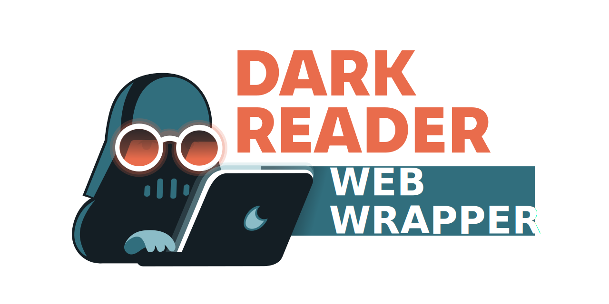

Dark Reader's web wrapper load sites and <strong>analyzes</strong> those web pages and aims to <strong>reduce the eyestrain</strong> while you browse the page.

 
    
<h2 align="center">Dark Reader's web wrapper</h2>
 

Dark Reader's Web wrapper is an <strong>open-source</strong> MIT-licensed <strong>site</strong>, that is designed to load regular web pages and use Dark Reader to analyze those pages. Based on its analysis Dark Reader will generate a dark mode based on this. Hereby Dark Reader aims to <strong>reduce the eyestrain</strong> of the user. Dark Reader is <strong>feature-rich</strong> and can be configured in many ways throughout the UI.

 
